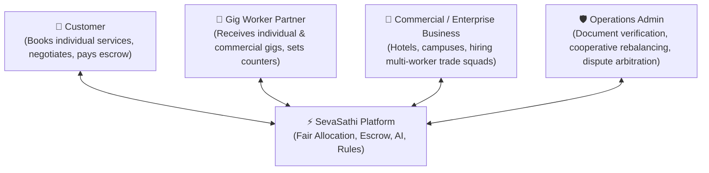
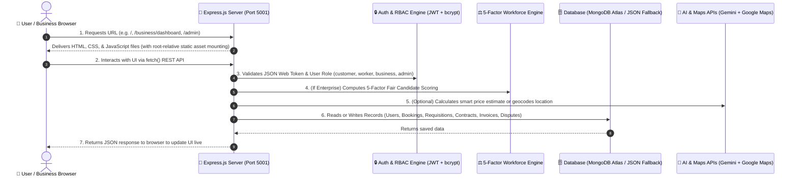
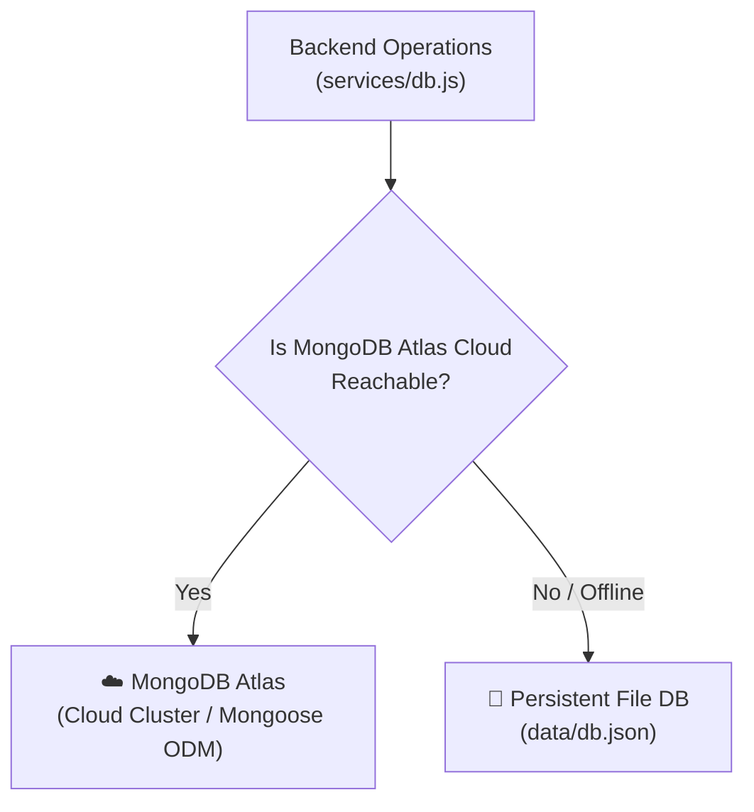
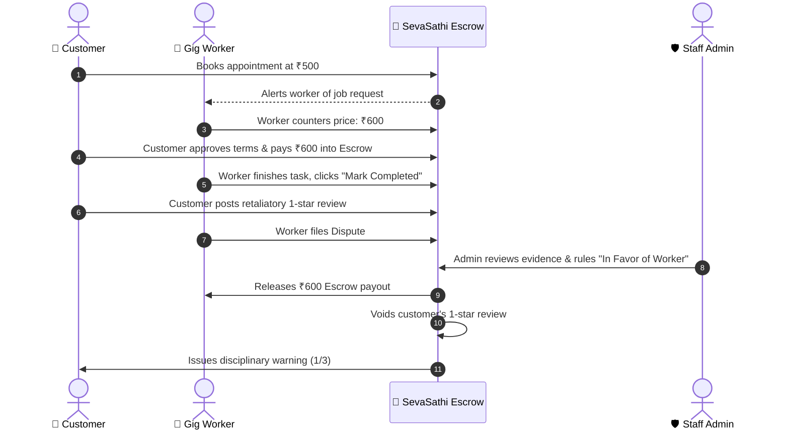
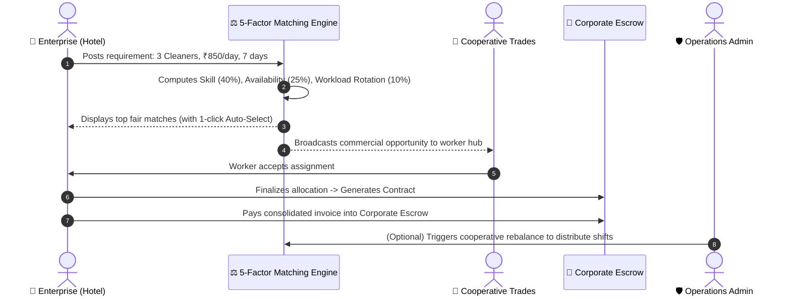

# 📘 SevaSathi Platform: Complete A–Z Technical Architecture Guide

> **Who this guide is for:** This document is designed for developers, teammates, Hackathon / SIH jury evaluators, and stakeholders who want a complete, beginner-friendly, and deep understanding of how SevaSathi works from top to bottom.

---

## 📑 Table of Contents
1. [The Big Picture: What is SevaSathi?](#1-the-big-picture-what-is-sevasathi)
2. [High-Level Architecture (The 30,000-Foot View)](#2-high-level-architecture-the-30000-foot-view)
3. [The Frontend (What the User Sees & Clicks)](#3-the-frontend-what-the-user-sees--clicks)
4. [The Backend (The Server & Business Logic)](#4-the-backend-the-server--business-logic)
5. [The Cooperative Workforce Allocation Engine](#5-the-cooperative-workforce-allocation-engine)
6. [The Database (Where Data Lives & Persists)](#6-the-database-where-data-lives--persists)
7. [Security & Authentication (How Access is Controlled)](#7-security--authentication-how-access-is-controlled)
8. [External Integrations & AI Intelligence](#8-external-integrations--ai-intelligence)
9. [End-to-End Journeys: Life of a Booking & Commercial Contract](#9-end-to-end-journeys)
10. [Project Directory & File Cheat-Sheet](#10-project-directory--file-cheat-sheet)

---

## 1. The Big Picture: What is SevaSathi?

Think of **SevaSathi** as an **"Egalitarian Cooperative Trade Marketplace and On-Demand Workforce Operating System"**.

Instead of merely displaying static phone numbers or allowing algorithmic monopolization where the highest-rated workers take 100% of jobs, SevaSathi operates as a **fair, dynamic 4-sided platform**:



1. **The Customer**: Searches for help, confirms their city location, books appointments, negotiates pricing via counter-bargaining in real time, pays into a secure escrow hold, and reviews completed work.
2. **The Gig Worker (Trade Partner)**: Registers their trade (electrician, plumber, etc.), uploads verification documents for review, receives incoming consumer requests AND enterprise cooperative opportunities, proposes counter-prices, and marks jobs completed for payout.
3. **The Commercial Business (Enterprise Partner)**: Hotels, hospitals, event managers, and facility management firms requesting multi-worker trade squads (e.g. 3 cleaners + 1 electrician + 1 plumber) for recurring or one-time shifts, matching via a 5-factor fair algorithm, and paying via consolidated escrow invoices.
4. **The Operations Admin (Staff)**: Privately accesses `/admin` to inspect worker certificates, approve or reject worker accounts, monitor customer disciplinary strikes, arbitrate dispute complaints, and trigger cooperative workforce rebalancing.

---

## 2. High-Level Architecture (The 30,000-Foot View)

SevaSathi is built as a **monolithic, unified full-stack web application**. **One single Express server process** runs the backend REST API, executes algorithmic matching, and simultaneously delivers the frontend web pages to the browser.



---

## 3. The Frontend (What the User Sees & Clicks)

The frontend is built using **pure, modern web standards**: **HTML5**, **CSS3**, and **Vanilla JavaScript (ES6+)**.

### Why No Heavy Frameworks?
- **Zero build step**: No complex Webpack, Vite, or Babel build steps; files load instantly in any browser.
- **Maximum performance**: Near-zero bundle overhead, smooth 60fps animations, lightning-fast initial load times on desktop and mobile.
- **Clean modularity**: Each portal is focused and resilient.

### Key Web Portals:

| Portal | File | Purpose |
| :--- | :--- | :--- |
| **Main Marketplace** | [`index.html`](file:///Users/shounakadhya/Downloads/Hustle/index.html) | Public homepage, 18 service cards, search bar with AI price suggestions, hero section with 60fps animations, and Cooperative Portal nav button. |
| **Authentication** | [`auth.html`](file:///Users/shounakadhya/Downloads/Hustle/auth.html) | Unified Sign-Up & Sign-In supporting 3 public roles: **Customer**, **Worker**, and **Business**, with instant role-specific redirects. |
| **Enterprise Business Portal** | [`business-dashboard.html`](file:///Users/shounakadhya/Downloads/Hustle/business-dashboard.html) | Dedicated enterprise portal: Requisition builder with live cost estimator, Algorithmic Fair Matching modal, Department Rosters, Contracts, Consolidated Invoicing, and Profile management. |
| **Customer Portal** | [`customer-dashboard.html`](file:///Users/shounakadhya/Downloads/Hustle/customer-dashboard.html) | Customer dashboard: Active appointments, counter-bargaining drawer, past booking history, review forms, and dispute filing. |
| **Worker Portal** | [`worker-dashboard.html`](file:///Users/shounakadhya/Downloads/Hustle/worker-dashboard.html) | Worker dashboard: Incoming consumer requests queue, commercial enterprise opportunities feed, counter-bargaining price tool, work completion toggle, and ratings history. |
| **Admin Console** | [`admin.html`](file:///Users/shounakadhya/Downloads/Hustle/admin.html) | Dedicated staff portal: Partner verification document viewer, customer account disciplinary counters, dispute arbitration console, and cooperative workforce rebalancing tab. |

### Frontend Style Architecture:
- **[`styles.css`](file:///Users/shounakadhya/Downloads/Hustle/styles.css)**: Core brand design system (SevaSathi Mint `#F5FBF7`, Brand Green `#16A34A`, Forest `#166534`, and Fraunces serif typography).
- **[`business-dashboard.css`](file:///Users/shounakadhya/Downloads/Hustle/business-dashboard.css)**: Glassmorphic executive layout, KPI metric cards, candidate fair badges, department accordions, and invoice cards.
- **[`dashboard-animations.css`](file:///Users/shounakadhya/Downloads/Hustle/dashboard-animations.css)**: Next-level 60fps hardware-accelerated animations (headline shimmer, desynchronized badge levitation, 3D card lift, aurora mesh gradient, glossy button sweeps, and responsive cooperative topbar option).
- **[`header-layout.css`](file:///Users/shounakadhya/Downloads/Hustle/header-layout.css)**: Responsive two-row responsive topbar layout across desktop, tablet, and mobile.

---

## 4. The Backend (The Server & Business Logic)

The backend is built with **Node.js** and **Express.js** ([`server.js`](file:///Users/shounakadhya/Downloads/Hustle/server.js)).

### How Express Routes Work:

#### 1. Page Routes (HTML delivery)
Express serves both clean URLs and static HTML pages:
```javascript
// server.js
app.get('/business/dashboard', (req, res) => res.sendFile(path.join(__dirname, 'business-dashboard.html')));
app.get('/admin', (req, res) => res.sendFile(path.join(__dirname, 'admin.html')));
app.get('/customer-dashboard', (req, res) => res.sendFile(path.join(__dirname, 'customer-dashboard.html')));
app.get('/worker-dashboard', (req, res) => res.sendFile(path.join(__dirname, 'worker-dashboard.html')));
```
*Dual static mounting (`app.use(express.static(...))` and `app.use('/business', express.static(...))` ensures all assets resolve flawlessly regardless of URL depth.*

#### 2. REST API Route Architecture:
- **[`routes/auth.js`](file:///Users/shounakadhya/Downloads/Hustle/routes/auth.js)**:
  - `POST /api/auth/signup`: Validates customer, worker, and business registrations.
  - `POST /api/auth/login`: Issues signed 7-day JWT tokens.
  - `GET /api/auth/bookings`: Consumer appointment feed.
  - `POST /api/auth/bookings/:id/respond`: Counter-bargaining and acceptance.
  - `POST /api/auth/tickets`: Confidential dispute filing.
  - `POST /api/auth/admin/tickets/:id/settle`: Staff dispute verdicts & retaliatory rating voiding.
- **[`routes/business.js`](file:///Users/shounakadhya/Downloads/Hustle/routes/business.js)**:
  - `GET /api/business/dashboard`: Executive KPI stats and overview.
  - `POST /api/business/requirements`: Create multi-worker enterprise requisitions.
  - `GET /api/business/requirements/:id/match`: Executes the 5-Factor Weighted Fair Matching Engine.
  - `POST /api/business/requirements/:id/allocate`: Finalizes candidate allocation, locks contract, and creates itemized invoice.
  - `GET /api/business/worker/opportunities`: Worker feed for discovering commercial enterprise gigs.
  - `POST /api/business/worker/opportunities/:id/accept`: Worker acceptance of commercial assignments.
  - `GET /api/business/workforce/roster`: Department-grouped workforce view.
  - `POST /api/business/invoices/:id/pay-escrow`: Processes demo corporate escrow deposit.
  - `POST /api/business/admin/requirements/:id/rebalance`: Admin intervention to rebalance workload distribution.
- **[`routes/ai.js`](file:///Users/shounakadhya/Downloads/Hustle/routes/ai.js)**:
  - `POST /api/ai/estimate-price`: AI heuristic market rate calculator.

---

## 5. The Cooperative Workforce Allocation Engine

A central innovation of SevaSathi is the **Cooperative Fair Workforce Allocation Engine** in [`routes/business.js`](file:///Users/shounakadhya/Downloads/Hustle/routes/business.js).

### The Problem in Traditional Gig Apps:
In standard marketplaces, a "winner-take-all" algorithm allocates 90% of jobs to the top 5% of highest-rated workers, leaving newcomer or unallocated cooperative members with zero income.

### The SevaSathi 5-Factor Mathematical Formula:
$$\text{Candidate Score} = S_{\text{skill}} (40\%) + S_{\text{availability}} (25\%) + S_{\text{proximity}} (15\%) + S_{\text{workload}} (10\%) + S_{\text{rating}} (10\%)$$

| Factor | Weight | Evaluation Logic |
| :--- | :--- | :--- |
| **Skill Match** | **40%** | Exact primary trade match = 40 pts. Secondary match = 25 pts. Partial match = 15 pts. |
| **Availability** | **25%** | Active / Online / Accepting Gigs = 25 pts. Part-time / scheduled = 15 pts. |
| **Proximity** | **15%** | Same city/locality = 15 pts. $\le 5\text{km} = 12\text{ pts}$, $\le 10\text{km} = 8\text{ pts}$, $> 10\text{km} = 5\text{ pts}$. |
| **Workload Rotation (Egalitarian)** | **10%** | **Inversely proportional to current active jobs:**<br/>• Active jobs $\le 1$: **10 pts** (Highest rotation priority)<br/>• Active jobs $2 - 3$: **7 pts**<br/>• Active jobs $4 - 6$: **4 pts**<br/>• Active jobs $> 6$: **2 pts** |
| **Rating & Reliability** | **10%** | Scaled proportionally: $\text{Rating} \times 2$ (capped at 10 pts). |

### Anonymized Privacy Protection:
Candidates in the matching modal are displayed with privacy-preserving pseudonyms (e.g. `W-ZWCL`), locality, distance, skills, and their fair allocation badge ($\ge 85\%$ High Allocation, $\ge 70\%$ Balanced Allocation).

---

## 6. The Database (Where Data Lives & Persists)

SevaSathi uses a **Dual-Mode Resilient Database Architecture** ([`services/db.js`](file:///Users/shounakadhya/Downloads/Hustle/services/db.js)):



### 1. Primary Engine: MongoDB Atlas
When online, Mongoose ODM enforces strict schemas:
- **`models/User.js`**: Users with roles `'customer'`, `'worker'`, `'business'`, `'admin'`. Includes business fields (`businessName`, `businessType`, `contactPerson`, `address`, `gstin`, `cin`, `website`).
- **`models/Booking.js`**: Consumer appointments with negotiation history, payment escrow state, rating, and dispute tracking.
- **`models/Ticket.js`**: Formal confidential arbitration tickets with verdict actions.
- **`data/db.json` (Enterprise Entities)**:
  - `requirements`: Commercial requisitions with staffing count, shift hours, dates, and status (`open`, `matching`, `allocated`, `contracted`).
  - `contracts`: Legally binding commercial agreements (`#CNT-2026-XXXX`) with daily rates, duration, and worker allocations.
  - `invoices`: Consolidated corporate invoices (`#INV-2026-XXXX`) tracking total wage + 5% platform cooperative reserve and corporate escrow transaction IDs.

### 2. Automatic Fallback Engine: `data/db.json`
If network connectivity is unavailable, the system automatically falls back to `data/db.json`, guaranteeing **zero downtime and zero crashes**.

---

## 7. Security & Authentication (How Access is Controlled)

### 1. Password Protection with `bcryptjs`
All passwords are encrypted with salted one-way mathematical hashes (`bcrypt.hash(password, 10)`). Plain-text passwords are never stored or logged.

### 2. Digital VIP Wristbands: JSON Web Tokens (JWT)
Upon successful sign-in, the backend issues an HMAC SHA-256 signed JWT containing `userId` and `role`, valid for **7 days**. All subsequent API requests carry:
```http
Authorization: Bearer <token>
```

### 3. Role-Based Access Control (RBAC)
Middleware verifies roles before executing endpoints:
- Customers cannot call `/api/business/requirements` or `/api/auth/admin/*`.
- Workers cannot self-accept their own counter-offers.
- Non-admin users cannot access the arbitration or rebalancing console.

---

## 8. External Integrations & AI Intelligence

### 1. Google Maps & Geocoding
- **Location Gate**: Customers confirm their city on login, geocoding GPS coordinates into city names (Bengaluru, Mumbai, Delhi, etc.) to deliver localized pricing.

### 2. Google Gemini AI & Market Rate Heuristics
- **Dynamic Demand Pricing**: AI models check local supply-demand density in real time to calculate equitable suggested prices, preventing predatory price surges.

### 3. Real-Time Cost Estimator Widget
- Built directly into the Enterprise Portal:
  $$\text{Total Budget} = (N_{\text{workers}} \times \text{Daily Rate} \times \text{Days}) \times 1.05$$
  Computes base wages and the 5% cooperative reserve in real time as inputs change.

---

## 9. End-to-End Journeys

### Journey A: Consumer Booking & Dispute Arbitration


### Journey B: Enterprise Multi-Worker Staffing Contract


---

## 10. Project Directory & File Cheat-Sheet

| Directory / File | Layer | Role & What it Does |
| :--- | :--- | :--- |
| [`server.js`](file:///Users/shounakadhya/Downloads/Hustle/server.js) | Backend Core | Express server on port 5001. Dual-route static mounting, database init, and API routing. |
| [`routes/auth.js`](file:///Users/shounakadhya/Downloads/Hustle/routes/auth.js) | Backend API | Registration, authentication, booking bargaining, dispute arbitration, and admin verification. |
| [`routes/business.js`](file:///Users/shounakadhya/Downloads/Hustle/routes/business.js) | Backend API | Multi-worker staffing, 5-factor fair matching algorithm, contract allocation, and escrow billing. |
| [`routes/ai.js`](file:///Users/shounakadhya/Downloads/Hustle/routes/ai.js) | Backend API | AI service pricing estimation and diagnostics. |
| [`services/db.js`](file:///Users/shounakadhya/Downloads/Hustle/services/db.js) | Database Layer | Dual-mode manager: MongoDB Atlas with automatic fallback to persistent `data/db.json`. |
| [`models/`](file:///Users/shounakadhya/Downloads/Hustle/models/) | Database Schemas | Mongoose models: `User.js`, `Booking.js`, `Ticket.js`. |
| [`index.html`](file:///Users/shounakadhya/Downloads/Hustle/index.html) | Frontend Page | Main marketplace homepage with 60fps animations and Cooperative Portal button. |
| [`business-dashboard.html`](file:///Users/shounakadhya/Downloads/Hustle/business-dashboard.html) | Frontend Page | Enterprise portal: Requisitions, matching modal, department rosters, contracts, invoices. |
| [`business-dashboard.css`](file:///Users/shounakadhya/Downloads/Hustle/business-dashboard.css) | Frontend Style | Executive glassmorphic dashboard design system, KPI cards, and modal styling. |
| [`business-dashboard.js`](file:///Users/shounakadhya/Downloads/Hustle/business-dashboard.js) | Frontend Script | Live cost calculator, candidate auto-select, contract generation, and profile management. |
| [`dashboard-animations.css`](file:///Users/shounakadhya/Downloads/Hustle/dashboard-animations.css) | Frontend Style | 60fps animations: Shimmer, levitation, 3D card lift, aurora mesh, glossy button sweeps. |
| [`customer-dashboard.html`](file:///Users/shounakadhya/Downloads/Hustle/customer-dashboard.html) | Frontend Page | Customer portal for booking management, escrow payments, and reviews. |
| [`worker-dashboard.html`](file:///Users/shounakadhya/Downloads/Hustle/worker-dashboard.html) | Frontend Page | Gig worker portal for incoming jobs, commercial opportunities feed, and earnings. |
| [`admin.html`](file:///Users/shounakadhya/Downloads/Hustle/admin.html) | Frontend Page | Operations console for worker document audits, dispute settlements, and rebalancing. |
| [`admin.js`](file:///Users/shounakadhya/Downloads/Hustle/admin.js) | Frontend Script | Controller for admin approvals, dispute verdicts, and cooperative rebalancing. |
| [`booking-system.js`](file:///Users/shounakadhya/Downloads/Hustle/booking-system.js) | Frontend Script | Booking lifecycle controller, counter-bargaining drawer, and escrow management. |
| [`script.js`](file:///Users/shounakadhya/Downloads/Hustle/script.js) | Frontend Script | Marketplace search, AI suggestions, category filtering, and location modal. |
| [`session.js`](file:///Users/shounakadhya/Downloads/Hustle/session.js) | Frontend Script | Unified client-side JWT session abstraction (`window.SevaSathiSession`). |
| [`logo.png`](file:///Users/shounakadhya/Downloads/Hustle/logo.png) | Static Asset | Official brand handshake "S" emblem with dark squircle border. |
| [`favicon.png`](file:///Users/shounakadhya/Downloads/Hustle/favicon.png) | Static Asset | High-res browser tab icon. |
